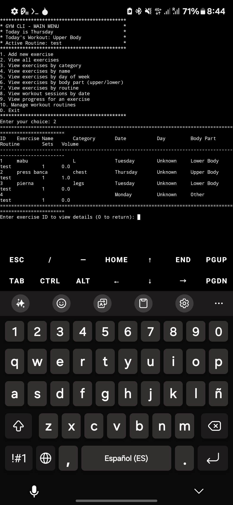

# GymCli

A command line interface app for the gym because I'm a geek.

## What it does

This is a simple CLI app that:
- Tracks exercises with sets, reps, weights, and duration
- Organizes workouts by body part (upper, lower, full)
- Manages workout routines with specific day assignments
- Shows progress charts for exercises over time
- Works entirely in your terminal

## Installation

### Build from source

```bash
# Clone the repository
git clone https://github.com/yourusername/gymcli.git
cd gymcli

# Build
make

# Install
make install

# Run
gymcli
```

### Uninstall

```bash
make uninstall
```

## Usage

The interface is menu-driven with numbered options:



1. Add new exercise - Record your workout data
2. View all exercises - See everything you've done
3. View exercises by category - Filter by muscle group
4. View exercises by name - Find a specific exercise
5. View exercises by day of week - See what you did on Mondays
6. View exercises by body part - Upper/lower/full body splits
7. View exercises by routine - What's part of your program
8. View workout sessions by date - See complete workouts
9. View progress for an exercise - Track improvements
10. Manage workout routines - Create, edit, delete routines

## Features

- **Exercise tracking**: Record reps, time, weights, and calculate volume
- **Workout routines**: Create routines with specific body parts assigned to each day of the week

- **No frills**: Just text, numbers and minimal UI


## Technical stuff

- Written in C++11
- Uses text files for data storage
- No external dependencies
- Terminal-based interface

## Other

This is just a personal project. Feel free to fork it if you want to modify it for your own use.
